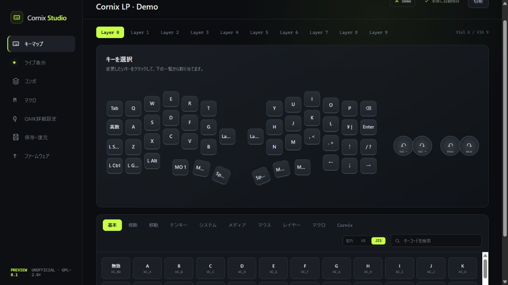

<p align="center">
  
</p>

<h1 align="center">Cornix Studio</h1>

<p align="center">
  Cornix LPのキーマップを、USBでもBluetoothでも編集できるWindowsアプリ
</p>

<p align="center">
  <a href="https://github.com/Ponkan230/cornix-studio/releases/tag/v0.1.0-preview.1"></a>
  
  <a href="COPYING"></a>
</p>

<p align="center">
  <a href="https://github.com/Ponkan230/cornix-studio/releases/download/v0.1.0-preview.1/cornix-studio.exe"><strong>Windows版をダウンロード（Preview 0.1）</strong></a>
  ·
  <a href="https://github.com/Ponkan230/cornix-studio/releases/tag/v0.1.0-preview.1">リリースノート</a>
  ·
  <a href="https://github.com/Ponkan230/cornix-studio/issues/new">不具合を報告</a>
</p>

<p align="center">
  <a href="docs/images/cornix-studio-keymap.png"></a>
</p>

Cornix Studio is an unofficial, fast Vial-compatible Windows configurator for
the Cornix LP split mechanical keyboard. It supports USB and paired Bluetooth
HID connections, JIS keycodes, live key/layer monitoring, backup and firmware updates.

## まず使ってみる

1. [`cornix-studio.exe`](https://github.com/Ponkan230/cornix-studio/releases/download/v0.1.0-preview.1/cornix-studio.exe)をダウンロードします。
2. USBで接続するか、Windowsの「Bluetoothとデバイス」でCornix LPをペアリングします。
3. アプリを起動し、一覧からCornix LPを選択します。

インストーラーは不要です。現在のプレビュー版はコード署名を行っていないため、
Windows SmartScreenの警告が表示される場合があります。配布元が
`github.com/Ponkan230/cornix-studio`、ファイル名が`cornix-studio.exe`であることを確認してください。

実機を接続しなくても、起動画面の「実機なしでデモを開く」から操作を確認できます。

## 主な特長

- USB・Bluetoothのどちらでもキーマップを編集
- Cornix LPの実機形状、10レイヤー、JIS/USキーコードに対応
- 押したキーと移動したレイヤーをリアルタイム表示
- コンボ、マクロ、QMK詳細設定、バックアップ、ファームウェア更新を一つのアプリに統合

> [!IMPORTANT]
> Cornix Studioは[Ponkan230](https://github.com/Ponkan230)が開発する非公式のコミュニティプロジェクトです。
> Cornix、Jezail Funder/KeyWorks、Vialの各メーカー・プロジェクトによる公式アプリではなく、
> 提携・承認関係もありません。

従来のPython/PyQt版`vial-gui`を参考に、通信部分をRust、
デスクトップUIをTauri 2で再実装しています。

元のVial GUIは互換性確認のため、このリポジトリ直下に残しています。
新しいアプリは [`studio`](studio) にあります。

## 現在できること

- Windows上のVial Raw HIDデバイスを自動検出
- USBと、Windowsでペアリング済みのBluetooth HIDに同じ方法で接続
- キーボード本体からVial定義・プロトコル情報・全レイヤーを読み込み
- Cornix LP V1.12の50キーと左右エンコーダー4方向を実機どおりに表示
- 通常キーとエンコーダー回転方向をレイヤーごとに変更
- 32枠のコンボを読み込み、入力1～4キーと出力キーを編集・無効化
- コンボの入力キーをCornixレイアウトまたはキーコード一覧から選択
- 32個・合計1024 bytesのマクロを編集
- テキスト、キーのTap/Down/Up、待ち時間、並べ替えに対応
- `Macro 0`～`Macro 31`を通常キーやエンコーダーへ割り当て
- Cornixが公開する9項目のQMK詳細設定を編集・初期化
  - Tapping Term、Flow Tap、Tap Code Delay、Tap Hold Caps Delay
  - Permissive Hold、Hold On Other Key Press、Chordal Hold
  - Combo Term、One Shot Timeout
- キーマップ・エンコーダー・コンボ・マクロ・QMK詳細設定をJSONファイルへ保存
- Cornix Studio JSONとVial `.vil`の差分確認・復元
- 復元前の自動バックアップと、変更箇所だけを書き込む安全な復元
- 公式ZIPまたはleft/right用UF2からのファームウェア更新
  - UF2署名・ブロック構造・nRF52840 family ID・書き込み範囲を検証
  - 更新前の設定自動バックアップ
  - 左手→右手の順番ガイドと、各ユニットの書き込み直前確認
  - UF2ブートドライブの自動検出
- `BT0`～`BT2`、接続先の前後切替、Bluetooth情報消去、USB/Bluetooth出力切替を
  「Cornix」カテゴリから割り当て
- 実機なしで画面と操作を確認できるデモモード

Bluetooth通信にはWeb Bluetoothを使わず、Windowsが公開するHID
インターフェースを直接利用します。最初のペアリングだけはWindowsの
「Bluetoothとデバイス」で行ってください。

## 開発

必要なもの:

- Node.js 20以降
- Rust stable（MSVC）
- Microsoft C++ Build Tools
- WebView2

開発版を起動:

```text
studio\scripts\dev.cmd
```

テストとリリースビルド:

```text
studio\scripts\build.cmd
```

生成されるWindows実行ファイル:

```text
studio\src-tauri\target\release\cornix-studio.exe
```

## インストール

公開版はGitHubの
[Releases](https://github.com/Ponkan230/cornix-studio/releases)
からWindows用実行ファイルを取得できます。現在のプレビュー版はコード署名を行っていないため、
Windows SmartScreenの警告が表示される場合があります。配布元とファイル名を確認してから実行してください。

## 実機での使い方

1. USB接続、またはWindowsでCornix LPをBluetoothペアリングします。
2. Cornix Studioを起動して「再スキャン」を押します。
3. 一覧からCornix LPを選びます。
4. 変更したいキーまたはエンコーダー方向を選び、下の一覧から割り当てます。
5. コンボは左側の「コンボ」を開き、入力キーと出力キーを順番に設定します。
6. マクロは左側の「マクロ」で編集し、「本体へ保存」を押します。
7. キーマップの「マクロ」カテゴリから、作成したマクロの呼び出しキーを割り当てます。
8. 入力判定を調整する場合は「QMK詳細設定」で値を変更し、「本体へ保存」を押します。
9. 「保存・復元」から設定を「ダウンロード」フォルダーへバックアップできます。
10. キー、エンコーダー、コンボの変更はキーボード本体へすぐ保存されます。

## ファームウェア更新

1. 公式のCornixファームウェアZIPをダウンロードします。
2. WindowsのBluetooth設定からCornixの登録を削除します。
3. Cornix Studioの「ファームウェア」でZIPを選択します。
4. 画面の確認事項に同意すると、現在の設定が自動バックアップされます。
5. 左手だけをUSB接続し、リセットボタンを素早く2回押してUF2ブートモードにします。
6. 検出されたドライブへleft用UF2を書き込みます。
7. 同じ手順で右手へright用UF2を書き込みます。
8. 両方の電源を入れ直し、Bluetoothを再ペアリングします。
9. 必要に応じて「保存・復元」から更新前バックアップを復元します。

更新中はUSBケーブルを抜かず、必ず左右両方を同じバージョンへ更新してください。
別機種用・破損・左右不足のパッケージは書き込み前の検証で拒否されます。

`BT Clear`と`Peer Clear`はBluetooth情報を消去するキーコードです。
割り当て後にキーボード上で実行すると再ペアリングが必要になるため、用途を
確認してから使用してください。

タップダンスは対象外です。

## License

Copyright (C) 2026 Ponkan230 and Cornix Studio contributors.

GPL-2.0-or-later。このプロジェクトは
[vial-kb/vial-gui](https://github.com/vial-kb/vial-gui)
を基にした改変・再実装を含みます。ライセンス全文は[`COPYING`](COPYING)、
主要な依存関係と帰属表示は[`THIRD_PARTY_NOTICES.md`](THIRD_PARTY_NOTICES.md)を参照してください。

本ソフトウェアは有用であることを願って配布しますが、商品性・特定目的への適合性を含め、
明示・黙示を問わず一切の保証はありません。キーマップ変更やファームウェア更新を行う前に、
必ず設定をバックアップしてください。
